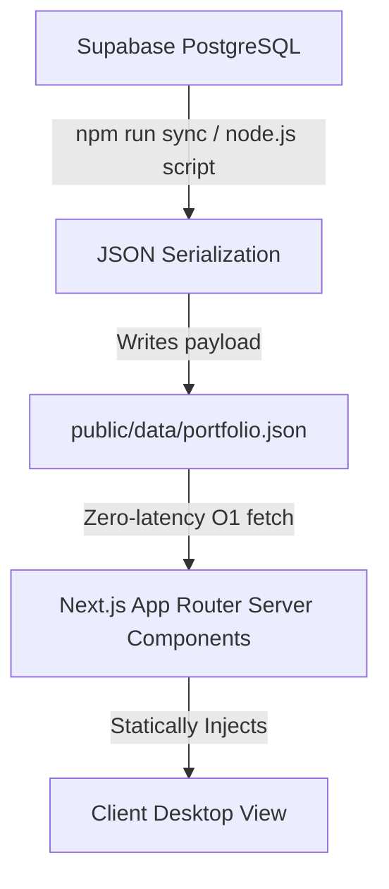

# Bhargava's Portfolio: The Ubuntu Experience 🐧

Welcome to my interactive portfolio! This project is designed to simulate a highly responsive **Linux Ubuntu desktop environment** directly within the browser ecosystem. It replaces traditional static scrolling pages with a full-fledged window management system to showcase my skills in advanced web architectures, physics-based interactions, and immersive UI/UX design.

## 🌟 General Features

Explore my portfolio exactly as you would navigate a real desktop operating system:

* **🪟 Interactive Window Management:** A custom-built windowing system allows you to open, drag, resize, maximize, minimize, and close application windows seamlessly. An embedded physics and boundary engine ensures windows remain locked within the safe desktop coordinates while preserving overlapping Z-index hierarchies.
* **🖥️ Authentic Desktop Environment:** Complete with an intuitive app Dock, interactive draggable desktop icons, right-click context menus, and flawlessly crafted UI components that rigidly echo the Ubuntu design language.
* **⏱️ Live System Top Bar:** Features a real-time ticking clock, a functional calendar dropdown built with day-picking date-math algorithms, and a sleek Quick Settings control center housing simulated volume and brightness sliders.
* **💻 3-Stage Bootloader Sequence:** Start the experience with an authentic Linux GRUB terminal boot trace, cascading progress animations, and a blurred Profile Lock Screen before authenticating into the Desktop.
* **📂 Root File System Navigation:** Browse through distinct "apps" and "folders" representing my Projects, Skills, Experience, and Certifications via an intuitive File Explorer interface powered by structured breadcrumb pathing.

---

## 🏗️ Technical Documentation

This project diverges significantly from standard portfolio sites, opting instead for a complex web-application architecture that balances intensive client-side interactivity with server-generated performance metrics.

### 🧠 Architectural Logic & Implemented Ideas

#### 1. Hybrid Rendering Pipeline (Static + Live)

To ensure the application runs at 60fps globally with zero database latency, it relies on a **Decoupled Backend Sync Architecture**.

Instead of fetching from the database inside React components on every page load, a custom Node.js build script (`scripts/syncPortfolio.ts`) is executed ahead-of-time. It connects to the Supabase PostgreSQL database, aggregates all tables (Profile, Projects, Skills, Education, etc.), recursively serializes the entire relational map, and statically compiles it into pure `.json` payloads (`public/data/portfolio.json`).

* **Why?** The Next.js frontend strictly consumes static JSON, guaranteeing `O(1)` fetch times, zero database connection limits, and robust fallback resilience. The portfolio acts as a pure View-Controller while the database serves only as an isolated headless CMS.

#### 2. The Window Manager (`<WindowProvider>`)

The heart of the OS is the global `WindowContext`. Rather than managing individual states per component, the architecture uses a centralized Redux-style React Context that maintains a canonical array of `Window` definitions.

* **Z-Index Sandboxing:** Whenever a window is focused (`setActiveWindow`), it calculates the maximum current Z-index in the stack and increments upon it, ensuring the currently selected window always renders on top.
* **Minimization Physics:** When a window minimizes, it visually scales down into the Dock while its internal component unmounts but preserves its virtual state ID, so restoring it snaps instantly back to its exact previous dimensions.

#### 3. Hydration-Aware Boot Sequence

The boot sequence introduces a `sibling overlay` architectural trick. Instead of wrapping the heavy React Desktop components *inside* the bootloader (which would cascade rendering delays), the `BootOverlay` operates purely visually *above* the Desktop. This relies entirely on inline CSS `animation-delay` mappings triggered securely on layout shift, protecting the Time-To-First-Byte (TTFB) while masking the React hydration cycle occurring silently underneath.

### 📚 Technical Stack & Library Rationale

The tech stack strictly embraces a highly modular paradigm:

| Library | Version | Architecture Rationale |
| :--- | :---: | :--- |
| **Next.js** | `16.0.3` | The core framework utilizing the App Router. Selected for its aggressive optimization capabilities (Server Components) and its foundational environment for our static data pipeline. |
| **React** | `19.2.0` | The view rendering engine. Leveraging React 19 concurrent features enabling our intensive `WindowProvider` updates to trigger without dropping visual callback frames. |
| **Tailwind CSS** | `^4.0.0` | The utility-first styling matrix. Upgraded to V4 to employ native cascade variables and high-performance inline CSS animations (used extensively in the pure-CSS bootloader), bypassing JS framerate bottlenecks entirely for raw styles. |
| **Motion** (Framer) | `12.23.25` | The physics animation engine. Handles the complex spring mathematics required to animate window opening, closing, and dock minimization smoothly based on arbitrary viewport sizes. |
| **React-RND** | `^10.5.2` | The draggable/resizable substrate sandbox. It inherently encapsulates pointer event delegation, bounding box collisions, and resize handles, which are otherwise highly expensive to implement cross-browser manually. |
| **Radix UI Primitives** | `^1.x - 2.x` | Headless, unstyled DOM primitives (`Accordion`, `DropdownMenu`, `Dialog`, `ScrollArea`). Essential for injecting native-OS accessibility (keyboard ARIA compliance, focus trapping, menu hierarchies) without opinionated styling conflicts. |
| **Supabase Client** | `^2.98.0` | Provides the decoupled remote connection logic executed during the `npm run sync` build steps to serialize remote POSTGRES data securely. |
| **Lucide React** | `^0.555.0` | Vector UI icons cleanly matched to the Ubuntu Yaru aesthetic, retaining crisp boundaries regardless of desktop DPI scaling. |
